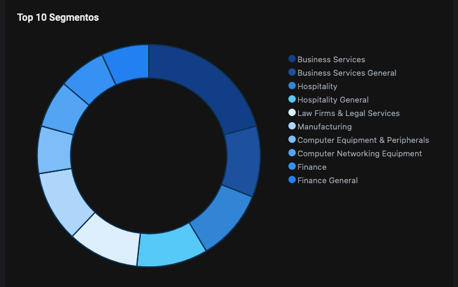

O grupo de Ransomware 8base teve sua primeira aparição no início de março de 2022, permanecendo de certa forma quieto após os ataques. O referido grupo atua como os demais atores de ransomwares, realizando a extorsão dupla. 
 
Ocorre que em meados de maio e junho de 2023, a operação do ransomware teve um pico de atividade contra organizações de vários setores listando até o momento 131 organizações em apenas 3 meses. 
   
O site de vazamento de dados da 8base foi crido e disponibilizado em março de 2023, alegando honestidade e simplicidade na sua fala. 

  

(Pesquisa realizada até 20 de Julho de 2023)

Dentre as vítimas, podemos mencionar diversas organizações Brasileiras que foram afetadas e anunciadas como vítimas pelo grupo de Ransomware. 

A empresa VMWare publicou um relatório sobre o 8base assimilando algumas semelhanças com o grupo ransomware “RansomHouse” , apontando semelhanças como o site utilizado pelo 8base e as notas de resgates apresentadas em seus ataques. 

Um fato curioso é que o grupo de Ransomware 8base não possui um ransomware próprio e desenvolvido pelo grupo, ao invés disto, os atores aproveitaram de outros builder vazados de ransomwares para personalizar a nota de resgate e apresentar para a organização vítima como sendo a operação do 8base. 

Como exemplo, realizei a análise do ransomware 8base apresentado em um incidente de segurança, sendo evidente que estes utilizaram no ataque uma variante do Ransomware Phobos  na versão 2.9.1, com um loader “SmokeLoader ” para as ofuscações iniciais e carregamento do ransomware no sistema. 

A análise foi publicada no site da empresa ISH, bem como foi possível indicar os TTPs de acordo com a amostra obtida e elaborada uma tabela contendo as TTPs utilizadas pelo payload do Ransomware.

Não existem muitas informações relacionadas a incidentes de segurança publicamente sobre o ransomware, apenas que utilizam builders de outros grupos.  

#### Top 10 Países

#### Top 10 Segmentos

