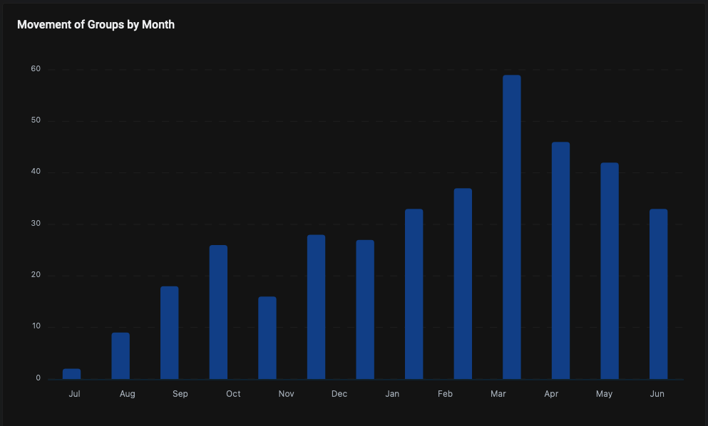
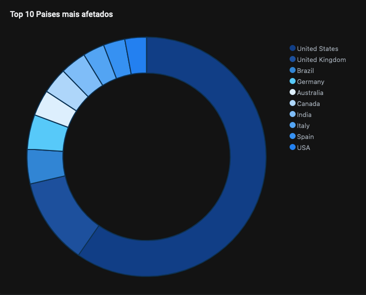
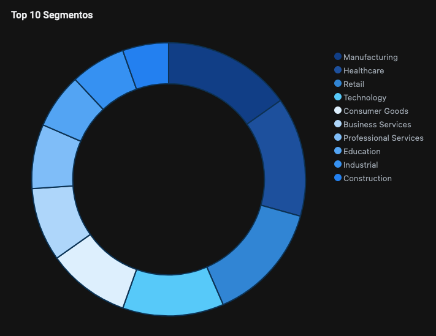

Os operadores do Ransomware ALPHV/BlackCat iniciaram a sua atividade em dezembro de 2021, realizando a publicação em fóruns da Dark Web com o intuito de propagar seu programa de afiliados, onde foi oferecido para outros atores a atuação de um “novo tipo de família de ransomware” desenvolvido do zero por meio da linguagem de programação Rust. 

  

Algumas evidências que ficaram claras é que os atores por trás deste novo ransomware não seriam novos no cibercrime, e havia vinculação a outros programas de afiliados como DarkSide, BlackMatter e REvil. (Após diversos ataques contra grandes empresas estes grupos sofreram pressões e prisões, havendo a necessidade de encerrar suas operações). 
  
Como forma de segurança, os operadores do ALPHV implementaram a necessidade de execução do payload do ransomware por meio de fornecimento de um “token de acesso”, o qual é fornecido pelos proprietários do Ransomware-as-a-Service ao afiliado. O referido token é adicionado na nota de resgate da vítima para que este realize o contato com o ator de ameaça responsável pela criptografia dos dados. 
  
Os afiliados do ALPHV utilizam técnicas de extorsões dupla e tripla, ou seja, a publicação do nome da empresa no site de vazamento, ameaça de vazamento de dados e por último ameaça de ataques DDoS contra a organização. 

#### Vítimas Mês a Mês

#### Top 10 Países

#### Top 10 Segmentos

