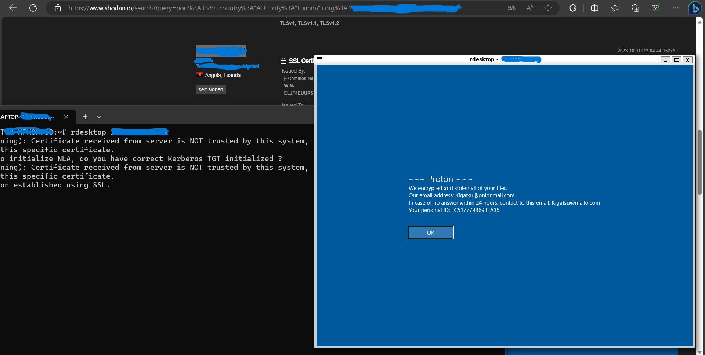

# PROTON RANSOMWARE

O Proton é uma infecção ransomware que criptografa partes potencialmente críticas de dados, exigindo pagamento para descriptografia completa. Durante o processo, o Proton também realiza alterações visuais nos arquivos, adicionando um endereço de e-mail (kigatsu@tutanota.com), ID da vítima e a extensão .kigatsu aos arquivos criptografados. Por exemplo, um arquivo como 1.pdf se transformará em algo como 1.jpg 1.

As vítimas do Proton Ransomware recebem uma nota de resgate informando que seus arquivos foram roubados e criptografados usando os algoritmos AES e ECC. A nota contém instruções sobre como efetuar o pagamento do resgate em troca da chave de descriptografia para recuperar os dados criptografados.

Utilizando o Shodan, foi possível mapear uma vítima afetada por esse ransomware:

 
    

**Detalhes sobre o Ransomware Proton:**

- **Tipo de Criptografia do Malware:** AES e ECC
- **Contatos do Cibercriminoso:**
  - **Telegram:** @ransom70
  - **Emails:**
    - kigatsu@tutanota.com
    - kigatsu@mailo.com

